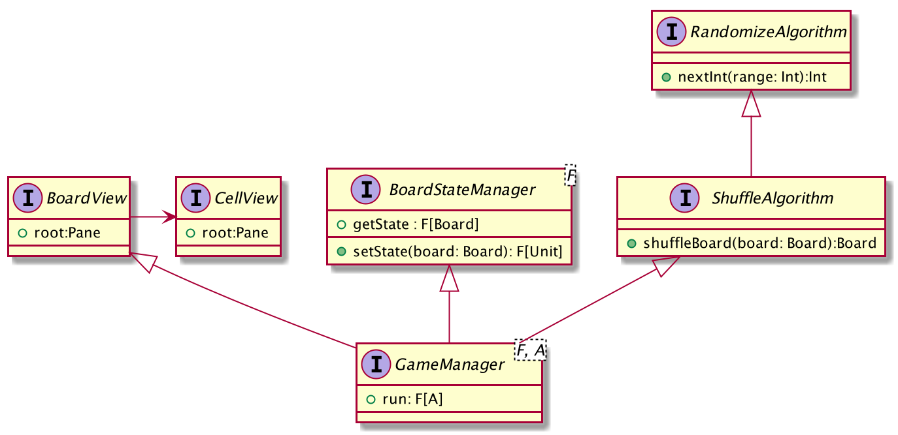

# Fifteen Puzzle Game
Simple implementation for puzzle fifteen game using ScalaFX

# How to run

```sbt run```

To run tests

```sbt test```

# Design


# What is missing

1. Current implementation of View is bad and have mutability that could be avoided
2. View logic isn't covered with tests
3. Error handling is missing, it just returns errors
4. Logging is missing
5. Code isn't clean
6. Documentation is not in good condition
7. It not well tested with gridSize > 4
8. On close actions
9. Hardcode values should be in config file
